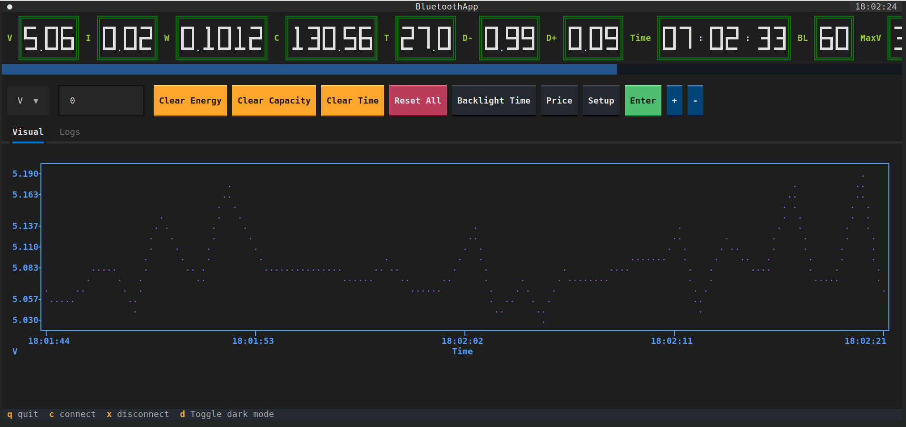

# Power Meter App

This is a simple power meter app that allows you to connect to J7-c or other similar Bluetooth power meters.

## Features

- Connect to J7-c or other compatible Bluetooth power meters
- View real-time power measurements
- Track power usage over time
- Export power data in various formats

## Installation

1. Clone this repository to your local machine.
2. Install the required dependencies by running `pip install -r requirements.txt`.
4. Start the app by running `python app.py`.

## Usage

1. Launch the app and ensure that your Bluetooth power meter is turned on and in pairing mode.
2. Click on the "Connect" button in the app to search for available devices.
3. Select your power meter from the list of available devices.
4. Once connected, you will be able to view real-time power measurements on the app's dashboard.
5. Use the app to track your power usage over time and export the data for further analysis.

## Screenshot

## Contributing

Contributions are welcome! If you have any suggestions, bug reports, or feature requests, please open an issue or submit a pull request.

## License

This project is licensed under the [MIT License](LICENSE).
